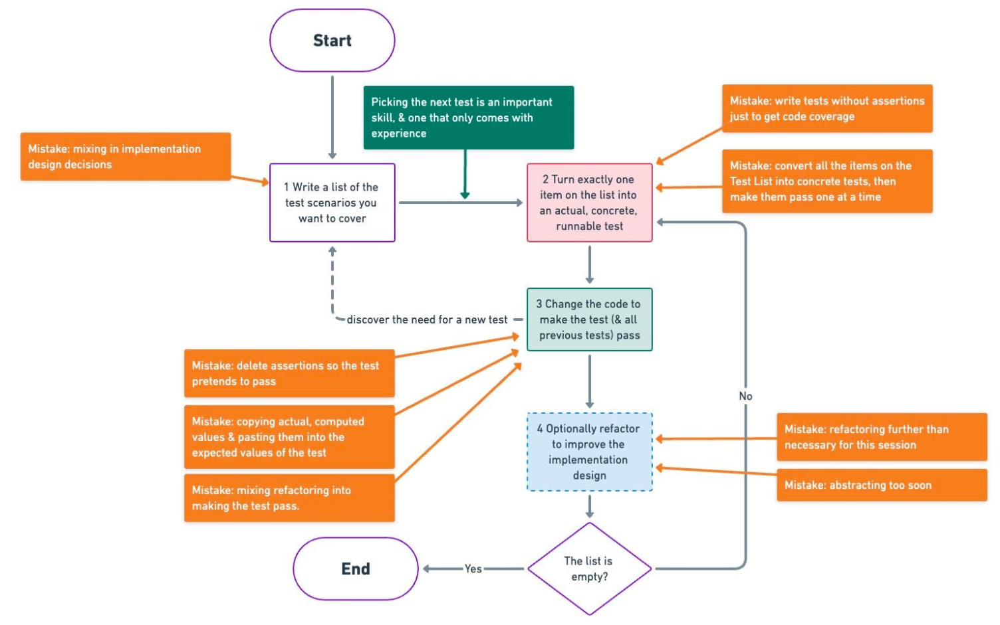

# Bowling Game Kata 🎳

Este repositorio contiene la resolución de la kata **Bowling Game**, una práctica clásica de desarrollo guiado por pruebas (**TDD**) que permite ejercitar principios de diseño incremental y buenas prácticas de código.

## Descripción de la Kata

La kata consiste en implementar una clase `Game` que simula una partida de bolos. Esta clase debe tener dos métodos:

- `roll(pins: int)`: se llama cada vez que el jugador lanza una bola y especifica cuántos bolos ha derribado.
- `score() -> int`: devuelve la puntuación total del juego al final de la partida.

### Reglas del juego de bolos

- El juego consta de 10 rondas (frames).
- En cada ronda, el jugador tiene hasta dos lanzamientos para derribar 10 bolos.
- Si derriba los 10 bolos en el primer lanzamiento, se llama **strike**.
- Si derriba los 10 bolos en dos lanzamientos, se llama **spare**.
- Los bonus:
  - Un **strike** otorga como bonus la suma de los dos siguientes lanzamientos.
  - Un **spare** otorga como bonus el siguiente lanzamiento.
- En la décima ronda, si el jugador hace un strike o spare, tiene lanzamientos adicionales para completar el bonus.

## Enlace oficial de la kata

Puedes consultar la descripción original de la kata en el siguiente enlace:

[kata-log.rocks/bowling-game-kata](https://kata-log.rocks/bowling-game-kata)

## Instalación

### Instalar uv

En Linux/macOS:

```shell
curl -Ls https://astral.sh/uv/install.sh | sh
```

En Windows (PowerShell):

```shell
irm https://astral.sh/uv/install.ps1 | iex
```

Verifica la instalación:

```shell
uv --version
```

### Instalar Python

```shell
uv python install 3.12
```

### Crear entorno virtual

```shell
uv venv --python 3.12
```

### Activamos el entorno

En Linux/macOS:

```shell
source .venv/bin/activate
```

En Windows (PowerShell):

```shell
.venv\Scripts\activate
```

### Instalar paquetes

```shell
uv pip install pytest
```

## Ejecutar tests

```shell
python -m pytest
```

## Objetivos

- Practicar TDD de forma disciplinada.
- Aplicar TPP para transformar el código de forma incremental.
- Diseñar una solución limpia, mantenible y extensible.
- Comprender las reglas del juego de bolos y modelarlas correctamente.

## TDD

Ciclo básico de TDD:



## TPP

Transformaciones priorizadas:


1. **({} → nil)**: No code at all → Code that returns or employs nil

2. **(nil → constant)**: Replace nil with a constant value

3. **(constant → constant+)**: Replace a simple constant with a more complex constant

4. **(constant → scalar)**: Replace a constant with a variable or argument

5. **(statement → statements)**: Add more unconditional statements

6. **(unconditional → if)**: Introduce a conditional (split the execution path)

7. **(scalar → array)**: Replace a scalar with an array

8. **(array → container)**: Replace an array with a more complex container (e.g., list, map)

9. **(statement → tail-recursion)**: Replace a statement with a tail-recursive structure

10. **(if → while)**: Replace a conditional with a loop

11. **(statement → non-tail-recursion)**: Replace a statement with a non-tail-recursive structure

12. **(expression → function)**: Replace an expression with a function or algorithm

13. **(variable → assignment)**: Replace the value of a variable (introduce assignment)

14. **(case)**: Add a case (or else) to an existing switch or if statement
